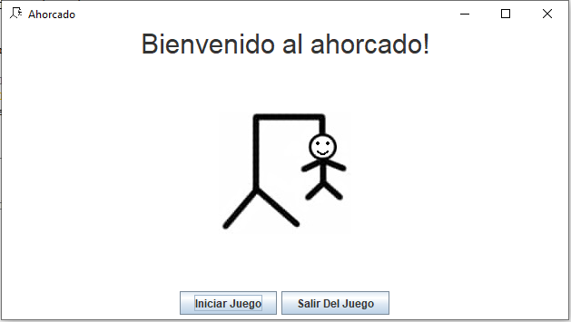
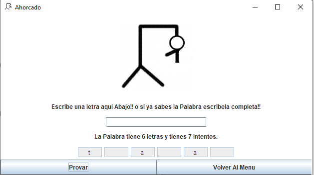
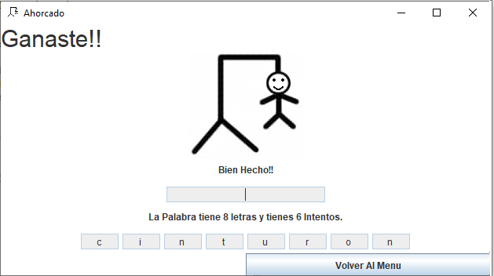

# Juego del Ahorcado

Este es un proyecto de un juego del ahorcado desarrollado en Java. El juego permite a los usuarios adivinar una palabra oculta, eligiendo letras o tratando de adivinar la palabra completa. La aplicación tiene una interfaz gráfica que es fácil de usar y proporciona una experiencia de juego divertida.


## Autor

Carlos Fernando Calderón

## Descripción

El juego del ahorcado consiste en adivinar una palabra oculta, letra por letra. Si el jugador elige una letra que no está en la palabra, se pierde un intento. El jugador gana si adivina la palabra completa antes de que se terminen los intentos.

## Características

- Interfaz gráfica intuitiva.
- Permite jugar con diferentes palabras.
- Contador de intentos restantes.
- Mensajes de error y éxito claros.

## Tecnologías Usadas

- Java SE
- Swing (para la interfaz gráfica)

## Requisitos

- JDK 11 o superior

## Instalación

1. Clona este repositorio en tu máquina local:

   ```bash
   git clone https://github.com/carlosoo7/juegoAhorcadojava.git
   ```

2. Navega a la carpeta del proyecto:

   ```bash
   cd juego_ahorcado
   ```

3. Abre el proyecto en tu IDE favorito (como IntelliJ IDEA o Eclipse).

## Uso

1. Ejecuta la aplicación:

   ```bash
   javac src/com/mycompany/juego_ahorcado/*.java
   java com.mycompany.juego_ahorcado.Juego_Ahorcado
   ```

2. La aplicación abrirá una ventana de bienvenida. Haz clic en "Iniciar Juego" para comenzar a jugar.

   
   

3. Introduce una letra o la palabra completa en el campo de texto y haz clic en "Probar" o presiona la tecla "Enter".

   

4. La aplicación mostrará el progreso y te indicará si has ganado o perdido.

   

## Estructura del Código

El código está organizado de la siguiente manera:

- **Juego_Ahorcado.java**: Clase principal que inicia la aplicación y configura la ventana.
- **MarcoAhorcado.java**: Clase que define el marco principal y gestiona los cambios de panel.
- **FrameMenu.java**: Clase que define el menú inicial del juego.
- **FrameJuego.java**: Clase que define el panel del juego y la lógica del juego.

### Ejemplo de Código

Aquí hay un ejemplo de cómo se configura el marco principal y cómo se maneja la lógica del juego:

#### Configuración del Marco Principal

```java
public class Juego_Ahorcado {
    public static void main(String[] args) {     
        MarcoAhorcado Juego = new MarcoAhorcado();
        Juego.setDefaultCloseOperation(JFrame.EXIT_ON_CLOSE);
    }
}
```

#### Lógica del Juego

```java
public void AccionProvar() {
    char o = 'a'; // Inicializa con un valor predeterminado
    try {
        o = Respuesta.getText().trim().toLowerCase().charAt(0);
        // Lógica para comprobar si la letra es correcta y actualizar el estado del juego
    } catch (StringIndexOutOfBoundsException b) {
        JOptionPane.showMessageDialog(null, "No has puesto nada en el recuadro", "Error", JOptionPane.WARNING_MESSAGE);
    }
}
```


